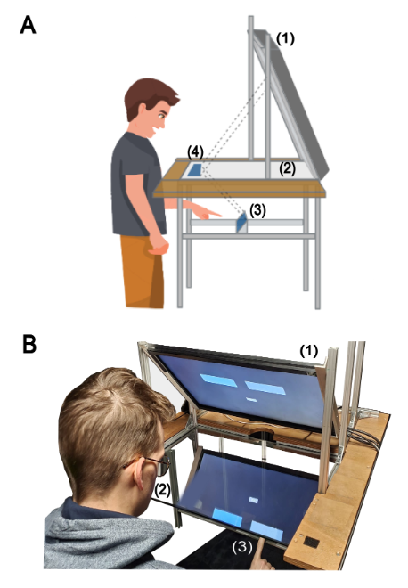
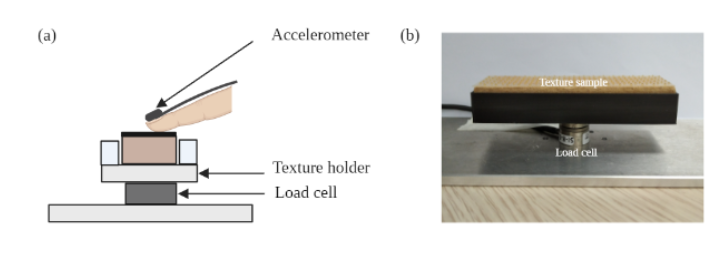

# TextSense project

### !! Prelimary results presented at [EuroHaptics 2022](https://www.eurohaptics2022.org/) !! 

### Authors: [Jenna Fradin](https://www.isir.upmc.fr/personnel/fradin/), [David Gueorguiev](https://www.isir.upmc.fr/personnel/gueorguiev/), [Sinan Haliyo](https://pages.isir.upmc.fr/shaliyo/)

It has been shown that people can potimally integrate tactile and visual cues to extract sensory cues. It is less clear though how the congruency between <strong>tactile</strong> and <strong>visual</strong> cues is perceived when people interact with everyday object such as fabrics.

We aim to investigate the human accuracy to detect <strong>visuo-haptic</strong> discrepancy within common fabrics.

## Methods

### a. Psychophysics

A frequently used strategy o investigate visuo-haptic integration is to create a sensory conflict. To do so, researchers create tasks in chich the visual information diverges slighlty from the haptic information. This approach makes it possible to estimate how the brain solves the challenge of integrating conflicting inputs from distinct sensory channels.

In this study, participant performed a serie of psychophysical experiments using a visuo-haptic workbench, which allows divergent colocated visual and tactile information to be presented.

<strong>Fig.1</strong> A. Schematic representation of the visuo-haptic workbench. B. Actual experiment setup. Participant viewed the projection of the visual stimuli displayed on the screen acrooss the semi-reflective mirror.

### b. Correlation with physical measurements

Previous studies have shown a correlation between physical surface properties and cross-modalitiy perceptual judgements.

Here, we collected contact forces and accelerations from an instrumented fingertip interaction with each surface

 

<strong>Fig.2</strong> (a) Schematic representation. (b) Texture sample mounted on the recording device. 

## Results

Results of the preliminary study are available Here: [POSTER](poster_WIP.pdf)

